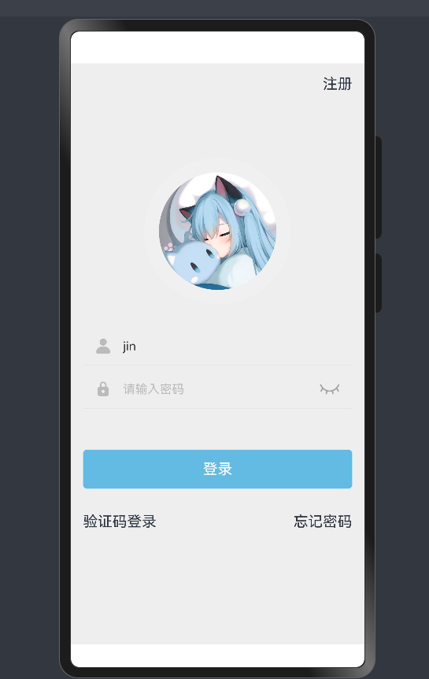
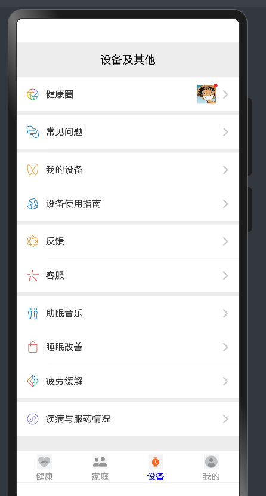
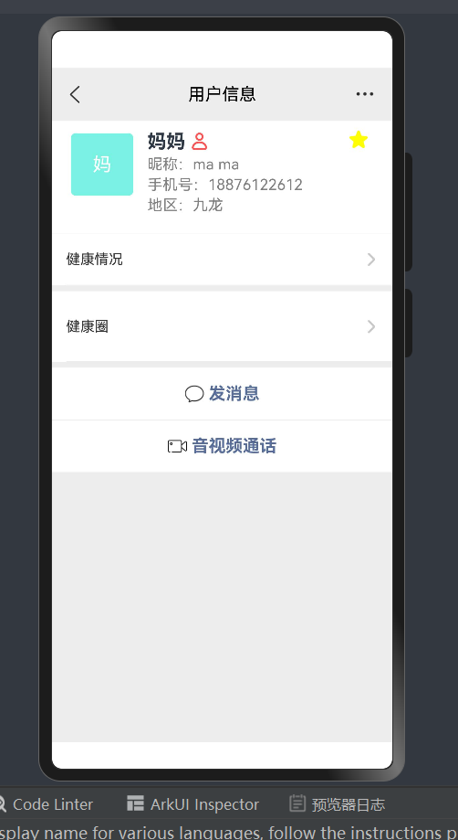
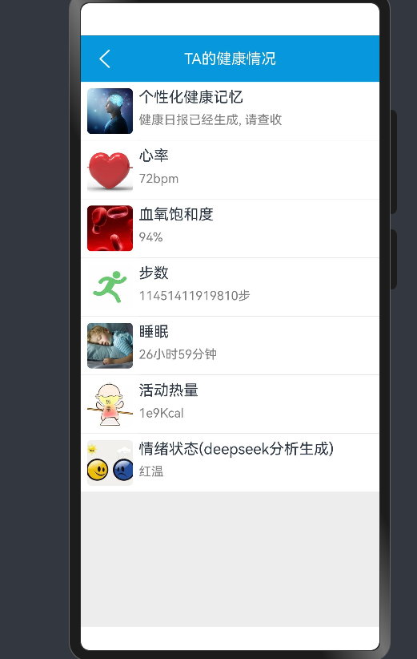
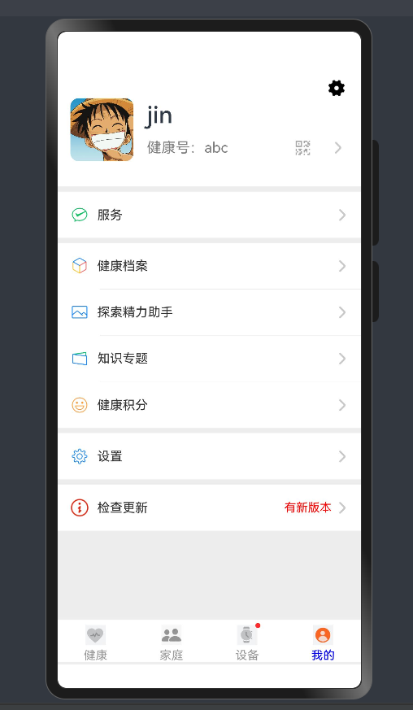
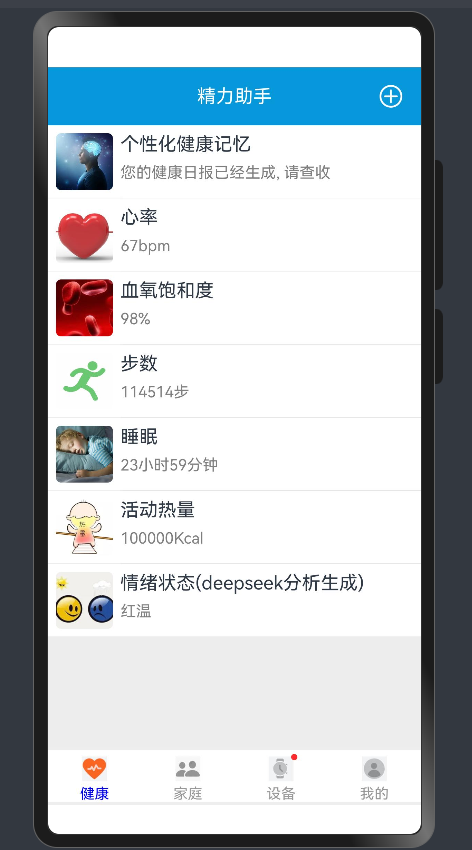
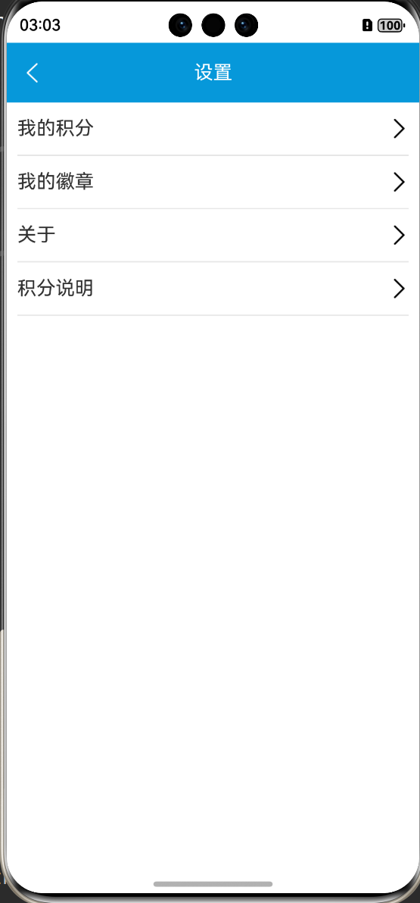
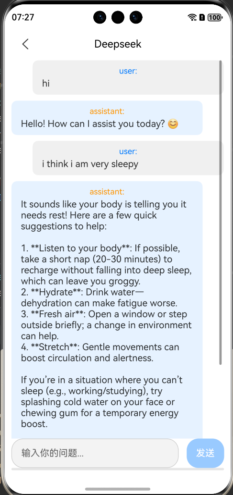

# Double-U：基于鸿蒙系统和微信页面的家庭健康助手
## 项目运行环境

* About HarmonyOS SDK
    * HarmonyOS 5.0.1 Release SDK, inclusion of OpenHarmony SDK Ohos_sdk_public 5.0.1.115 (API Version 13 Release) as is.

* About DevEco Studio
    * DevEco Studio 5.0.1 Release
    * Build Version: 5.0.5.310, built on December 13, 2024

# 主要功能（更新中）

🏡 **模仿微信界面的智能家庭健康助手**  
（手表插件 + AI 分析 + 健康排行榜）

## 🎯 核心目标
通过 **智能手表 + AI 分析** 实时监测生理 & 心理健康，让家庭成员可以共享健康数据。  
利用 AI 进行深度健康分析，提供个性化健康建议，并生成家庭健康排行榜促进互动。  
让健康管理变得智能化、数据化、游戏化，增强家庭成员间的正向陪伴。

### 🩺 1. 手表插件：实时健康监测

#### 📡 连接智能设备
支持设备：智能手表、颈椎按摩仪，自动同步数据到 APP。  
无感监测：数据自动上传，无需用户手动记录。

#### 📊 监测数据

**生理健康**  
- 心率（24h 监测 + 异常提醒）  
- 血氧（低于 90% 预警）  
- 血压 / 血糖（需外部设备）  
- 睡眠质量（深睡时长、多梦情况）  
- 运动情况（步数、运动类型、卡路里消耗）  
- 慢性病管理（服药提醒 + 记录病情指标）

**心理健康**  
- 情绪状态（结合睡眠 & HRV 评估）

### 🤖 2. AI 健康分析（DeepSeek / 自研模型）

#### 📈 健康趋势预测
结合数据分析个人 & 家庭健康趋势，例如：  
- “本周平均睡眠时间减少 30 分钟，注意调整作息。”  
- “你的心率比上周高 10%，可能与压力有关。”  
- “今天该服药啦！”

#### 🩺 个性化健康建议
针对每个人的情况，提供具体可执行的改善方案：  
- “建议每天多喝 500ml 水，降低血压风险。”  
- “本周步数减少 20%，可以试着每天散步 15 分钟。”

#### 🚨 健康预警
异常指标实时提醒：  
- 血氧 < 90% / 心率异常 → 立即推送警报。  
- 长期睡眠不足 → 提供睡眠优化建议。

#### 🗣 语音助手
用户可语音提问健康状况，例如：  
- “我今天的运动情况如何？”  
- “妈妈的血压最近稳定吗？”

### 🏆 3. 家庭健康排行榜

#### 📊 健康评分机制
AI 计算每位家庭成员的健康指数（0-100 分），基于：  
- 步数 & 运动量  
- 睡眠质量  
- 心率 / 血氧 / 压力指数  
- 健康习惯（服药情况、久坐提醒响应度）

#### 📊 数据可视化
以图表、进度条、排名曲线呈现，清晰直观。

#### 🏅 排行榜 & 激励

**健康挑战**  
设定目标（如 “家庭步数目标 20 万步”），所有成员共同努力。  
每个成员的贡献值可见，增强互动性。

**个性化奖励**  
TOP 3 成员解锁虚拟徽章（如“运动达人”）。  
达成目标可获得健康积分，兑换健康礼品或解锁新主题界面。

### 📅 4. 目标规划与时间管理
家庭成员可设定个人或共同目标，例如：  
- “每天坚持早睡 10:30”  
- “每周全家累计步数 20 万步”  
- “一个月内全家饮食健康评分提升 10%”

#### 📝 任务分解 & 时间节点
目标可以拆分为可执行的任务，如每日步数、饮食打卡。  
日历视图：让成员直观查看目标进度。  
待办事项列表：列出每日任务，便于跟踪。  
提醒功能：定期推送任务提醒，确保目标达成。

### ❤ 5. 增强家庭互动

#### 📡 情感互动提醒
AI 识别家庭成员需要陪伴的时刻，如：  
- “爸爸最近压力大，建议和他聊聊天。”  
- “孩子这周运动量低，建议和他一起运动。”

#### 🎮 轻互动 & 家庭小游戏
- “我猜你今天…”：家庭成员互猜情绪，增强共情能力。  
- 健康问答挑战：增加趣味性，提高健康知识。

### 🔗 6. 额外拓展
- 🛠 云端存储 & 隐私保护：数据加密，确保安全性。  
- 🏡 远程家庭关爱：支持跨家庭成员查看（如远程关心父母）。  
- 📅 健康日志：每天生成家庭健康日报，提供总结分析。

## 部分页面如下

